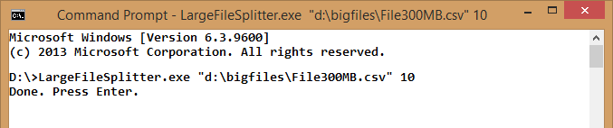
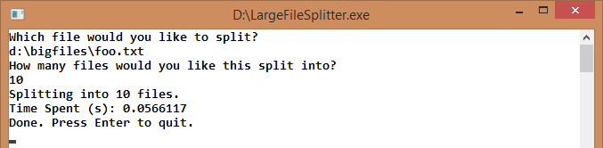

###Large File Splitter###

This is an application that will split a large text file into smaller files. This works great for splitting:

- comma separated values (csv) files
- log files

Sometimes you're dealing with a large text file that cannot load well in a text editor. This application will split the file into more files; as many as you like.

This application splits on **rows** or lines in the file. The original file isn't modified or deleted in any way.
 
### [Download this application (39KB)](https://github.com/philoushka/LargeFileSplitter/blob/master/CompiledBinary/LargeFileSplitter.exe) ###
 
####Running The Splitter App####

**The only requirement**: You'll need .NET Framework 4.5 installed on the machine.

The application will ask you for 2 pieces of information:

- the file to split (the source file)
- how many files you want (the target files)

**Sending Arguments**

You can pass these 2 values as arguments to the app from the command line.

**Running Interactively**
You can run the console app directly in Windows, and it'll prompt you for the 2 arguments it'll need.

####Notes####

- if your input file doesn't exist, you'll be notified with a message like `Couldn't find that file. We're done here.`
- if you enter a non-integer number(like `foo` or `4.5`, then the application will default to **2**.
- any existing split files will be overwritten.
- the first line from the file will be pasted into the top of each new file. We're assuming here that this line contains column names for a CSV.
- the new files will have the same case as the args you enter. i.e. `foo.csv` will produce `0-foo.csv`, even though the large file on disk is `Foo.CSV`. This is due to the implementation of [`FileInfo`](http://msdn.microsoft.com/en-us/library/system.io.fileinfo.aspx) in the .NET Framework.
- if the source file is empty, then the split files won't be created.
- as usual, you'll need double quotes surrounding your source file when sending a file path with spaces.

####Benchmarks####

- 300 MB csv file -> 4.3 sec.
- 600 MB csv file -> 8.6 sec.
- 1 GB csv file -> 61 sec.
